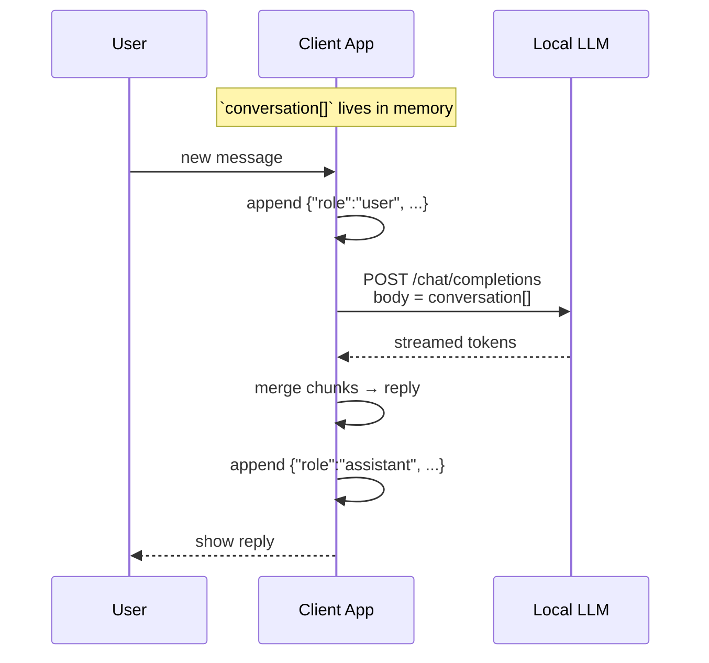

# Local LLM Conversation Memory Implementation Guide  
*Author: MomentX AI Team*  
*Last updated: 2025‑06‑12*

---

## 1  Purpose
This document explains **how to give a locally‑hosted large‑language‑model (LLM) short‑term “memory”** so that it can respond coherently across multiple turns of a chat conversation.  
Engineers can drop the reference Python snippet directly into a backend service or CLI chatbot.

---

## 2  Prerequisites
| Item | Version / Example |
|------|------------------|
| Local LLM engine | `llama.cpp`, `litellm local`, or any component exposing the *OpenAI‑style* `/v1/chat/completions` endpoint |
| Model file | `TheDrummer/Rocinante-12B-v1.1-GGUF` (or other) |
| Python 3.9+ | `requests` ≥ 2.31 |
| Token context length | ≥ 4 096 tokens (set by the model / engine build) |

---

## 3  API Contract Recap
```bash
curl http://localhost:1234/v1/chat/completions   -H "Content-Type: application/json"   -d '{
        "model": "TheDrummer/Rocinante-12B-v1.1-GGUF",
        "messages": [
          { "role": "system", "content": "Always answer in rhymes." },
          { "role": "user",   "content": "Introduce yourself." }
        ],
        "temperature": 0.7,
        "max_tokens": -1,
        "stream": true
      }'
```
The **LLM does _not_ store state**—all context must be resent on every call.

---

## 4  Conversation Memory Flow


---

## 5  Reference Python Implementation
```python
import requests, json, sys

API_URL = "http://localhost:1234/v1/chat/completions"
MODEL_ID = "TheDrummer/Rocinante-12B-v1.1-GGUF"
SYSTEM_PROMPT = "Always answer in rhymes."

def call_llm(conversation):
    r = requests.post(
        API_URL,
        json={
            "model": MODEL_ID,
            "messages": conversation,
            "temperature": 0.7,
            "max_tokens": -1,
            "stream": True,
        },
        stream=True,
        timeout=300,
    )
    chunks = []
    for line in r.iter_lines():
        if not line:
            continue
        data = json.loads(line.decode().lstrip("data: "))
        delta = data["choices"][0].get("delta", {}).get("content")
        if delta:
            chunks.append(delta)
    return "".join(chunks)

def chat():
    convo = [{"role": "system", "content": SYSTEM_PROMPT}]
    while True:
        user_msg = input("\nYou ▶︎ ")
        convo.append({"role": "user", "content": user_msg})

        reply = call_llm(convo)
        print(f"Bot ▶︎ {reply}")
        convo.append({"role": "assistant", "content": reply})

        # --- token‑budget guard (simple) ---
        if len(convo) > 40:              # rough msg‑count gate
            summary = call_llm([
                {"role": "system", "content": "Summarize briefly:"},
                *convo
            ])
            convo = [
                {"role": "system", "content": SYSTEM_PROMPT},
                {"role": "assistant", "content": f"Summary so far: {summary}"}
            ]

if __name__ == "__main__":
    try:
        chat()
    except KeyboardInterrupt:
        sys.exit(0)
```

---

## 6  Token‑Budget Management Strategies
| Strategy | Description | Pros | Cons |
|----------|-------------|------|------|
| Sliding window | Keep last *N* user+assistant pairs | Simple | Loses long‑range context |
| Summarisation | Condense earlier turns into a single assistant note | Retains key facts, saves tokens | Summary quality impacts accuracy |
| Vector DB retrieval (RAG) | Embed & store each turn; retrieve only top‑k similar lines per new query | Scales to large histories | Requires extra infra (DB, embeddings) |

---

## 7  Deployment Checklist
- [ ] Confirm model `context_length` ≥ expected window size  
- [ ] Handle SSE / chunked streaming properly (see sample)  
- [ ] Implement graceful **timeout** & **retry** logic  
- [ ] Log both user input and assistant output for audit (PII aware)  
- [ ] Unit‑test summariser if used (protect factualness)  
- [ ] Cap RAM usage (long chats ⇒ large Python lists)  

---

## 8  Change Log
| Date | Changes |
|------|---------|
| 2025‑06‑12 | Initial version |
